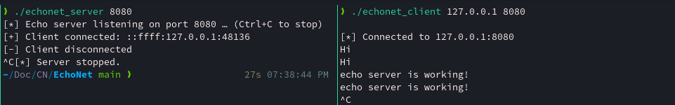

# EchoNet

**EchoNet** is a minimal networking project written in C that demonstrates how a basic TCP Echo Server and Client work at the socket programming level.

---

## What is an Echo Server?

An **Echo Server** is one of the simplest forms of a network service:
- A **server** listens for incoming connections on a specific IP address + port.
- A **client** connects to the server, sends a message, and receives the **same message back**.
- This "echo" loop makes it a perfect first step to understand how protocols like TCP work under the hood.

---

## How it works (Concept)

1. **Server (tcp_echo_server)**  
   - Creates a TCP socket.  
   - Binds it to a port (e.g., 8080).  
   - Listens for incoming client connections.  
   - Accepts a client → reads data → sends the same data back.  
   - Keeps running until manually stopped.  

2. **Client (tcp_echo_client)**  
   - Creates a TCP socket.  
   - Connects to the server’s IP + port.  
   - Sends user input text.  
   - Waits for the server to echo the text back.  
   - Prints the echoed response.

---


---

## Setup & Run

1. **Clone the repository**
```bash
git clone git@github.com:piyushdev04/EchoNet.git
cd EchoNet
```

2. **Compile the project** (or use the Makefile)

```bash
make
```

3. **Run the server**

```bash
./echonet_server 8080
```

4. **Run the client** (in another terminal or pane)

```bash
./echonet_client 127.0.0.1 8080
```

5. **Send messages**

* Type a message in the client terminal.
* See it echoed back from the server.

---

## Notes

* Make sure your firewall allows the chosen port (default: 8080).
* Both server and client must be running on the same network if not using localhost.

---
### Thanks for reading!🍁
